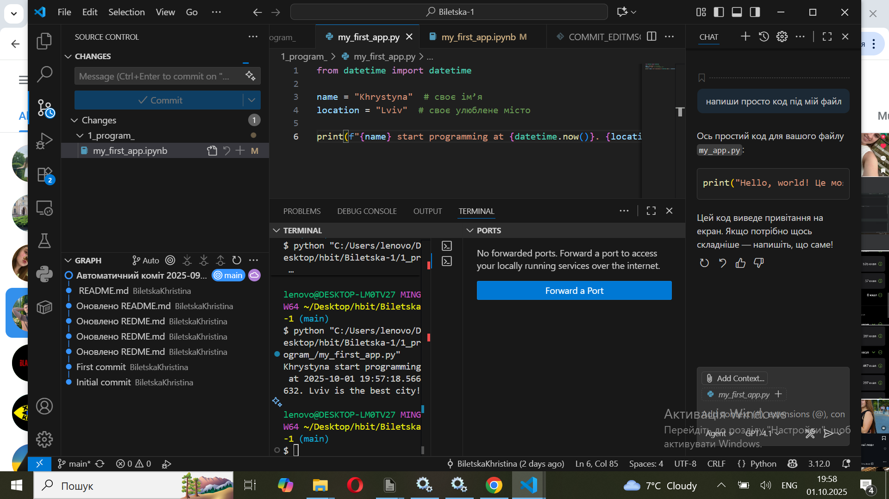
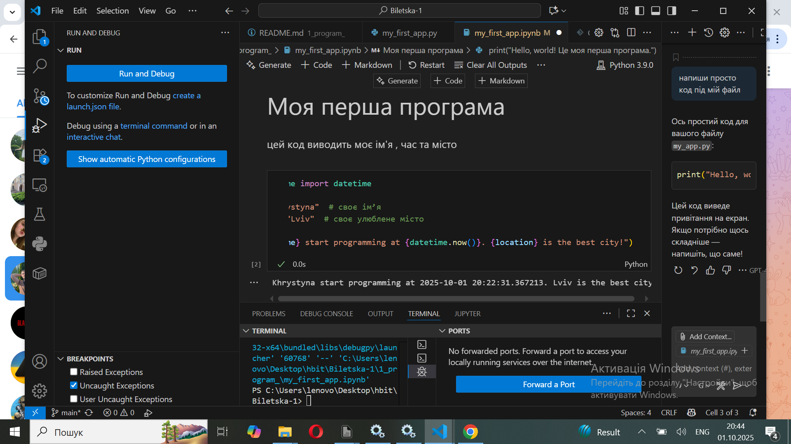
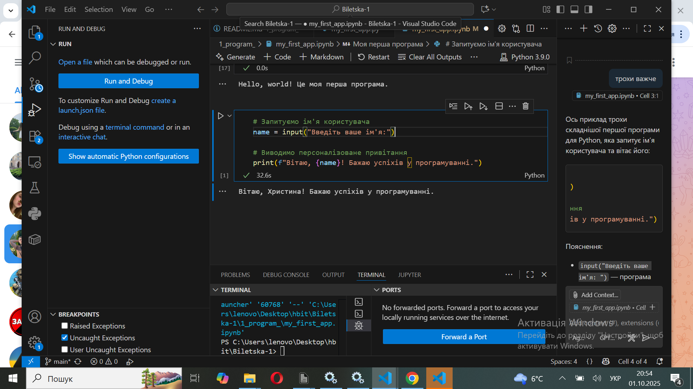

# Звіт до роботи
## Тема : Вступні заняття: налаштування середовища , початок роботи з Python та Markdown  
## Мета : Налаштувати середовище роботи VS Code, створити репозиторій Github та налаштувати інтеграцію з ним, написати першу програму на Python та створити звіт з використанням форматування Markdown;
# ✅ Результати виконання завдання

## i. Розробили / Створили
- 📄 Основний файл README.md у репозиторії.  
- 📂 Додаткову папку init з файлом README.md для експериментів.  
- 📝 Структурований опис репозиторію з використанням смайлів та різних рівнів заголовків.  

## ii. Програма вивела значення
- У Visual Studio Code у вікні попереднього перегляду (`Ctrl+Shift+V`) відобразився готовий форматований текст.  
- Після виконання commit та push зміни з’явилися на GitHub, і README став початковою сторінкою репозиторію.  

## iii. Отримано наступні результати
- ✔️ Оформлений репозиторій з інформативною початковою сторінкою.  
- 📑 Візуально зрозуміла таблиця лабораторних робіт.  
- 🔢 Зручний список майбутніх завдань.  
- 🖼️ Можливість додавати зображення, посилання та різні стилі тексту.  

## iv. Навчились
- ✍️ Використовувати синтаксис Markdown для оформлення тексту.  
- 😀 Додавати емоджі та піктограми.  
- 🖥️ Працювати з файлами README.md у VS Code.  
- 🔄 Виконувати commit та push, щоб оновлювати дані на GitHub.  
 # Програма вивела моє ім'я та моє улюблене місто

 # Chat - GPT

# Висновок: 
Звіт
 • Що зроблено в роботі:
Створено та відредаговано файли у форматі Markdown (README.md), додано папку init з власним файлом, протестовано різні можливості форматування (заголовки, списки, емодзі, посилання, вставка зображень). Також запущено першу програму на Python у середовищі Visual Studio Code.
 • Чи досягнуто мети роботи:
✅ Так, мета роботи досягнута – ознайомилася з основами Markdown та виконала практичні вправи з його використання.
 • Які нові знання отримано:
📌 Навчилася створювати та редагувати .md файли, використовувати базові елементи форматування, додавати зображення та емодзі. Дізналася, як працювати з GitHub та оновлювати репозиторій.
 • Чи вдалось відповісти на всі питання задані в ході роботи:
✅ Так, усі питання були розглянуті та опрацьовані.
 • Чи вдалося виконати всі завдання:
✅ Так, усі завдання виконані.
 • Чи виникли складності у виконанні завдання:
⚠️ Так, виникали складності при запуску програми на Python та при оновленні даних у GitHub, але вдалося їх вирішити.
 • Чи подобається такий формат здачі роботи (Feedback):
🙂 Так, зручний формат, оскільки можна одночасно практикуватися з Markdown і GitHub.
 • Побажання для покращення (Suggestions):
💡 Можна додати більше прикладів складнішого форматування Markdown (наприклад, таблиці, чек-бокси, цитати) та пояснення можливих помилок при роботі з GitHub.

