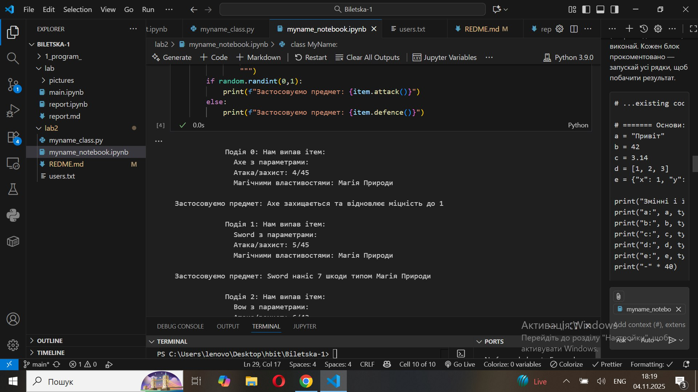
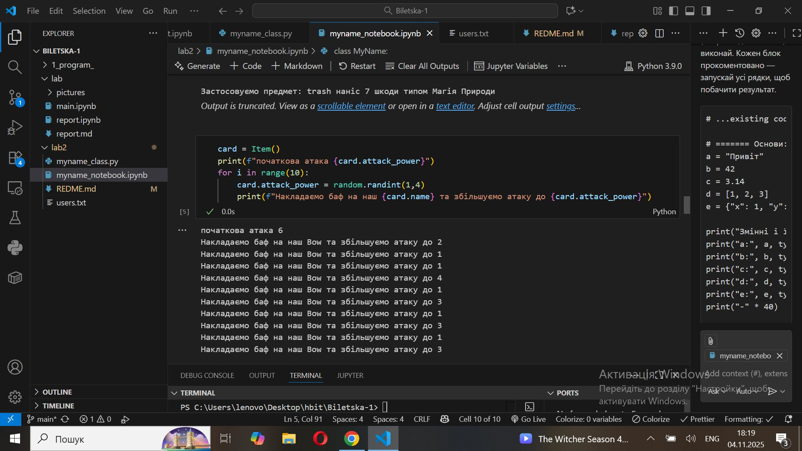
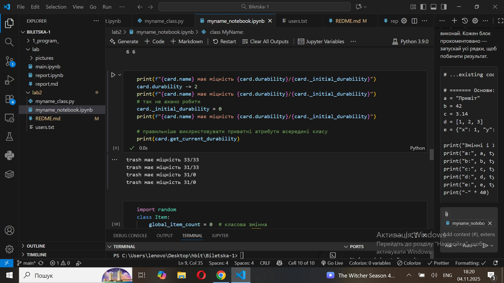

# 🧾 Звіт до лабораторної роботи №3

## 🔹 Тема: Знайомство з ООП

## 🎯 Мета роботи:

Навчитись використовувати основні принципи ООП, розглянути конструкції побудови
класу та створення об’єктів та навчитись працювати з ними.

## 🧩 Виконання роботи

# Перша програма на ООП


### 1️⃣ Теоретичні відомості

- Клас — це шаблон або узагальнення того, що ми хочемо описати.
- Об’єкт — це конкретний екземпляр класу, який має власні значення атрибутів.

---

### 2️⃣ Класичний та ООП підхід

Класичний підхід:

```python
import random

drop_chance = random.randint(1,100)

loot_table = {
    "trash": {"name": "Поломаний меч", "rarity": "grey", "attack_power": 1, "durability": 0, "magic_attribute": "Магія Землі", "description": "Продати"},
    "Sword": {"name": "Меч", "rarity": "epic", "attack_power": random.randint(5, 10), "durability": random.randint(40, 60), "magic_attribute": "Магія Вогню", "description": "Епічний меч"},
}

if drop_chance > 50:
    item = random.choice(list(loot_table.values()))
    print(f"Нам випав ітем: {item['name']} з атакою {item['attack_power']}")
else:
    print("Нам не повезло, фармимо далі.")


```

⚙️ Виконання роботи

🔹 Результати виконання завдань: i. Розробили клас MyName, який створює об’єкт
користувача з іменем та електронною поштою. ii. Додали можливість створення
користувача навіть без введення імені — у цьому випадку автоматично присвоюється
ім’я Anonymous. iii. Модифіковано метод init, щоб ім’я завжди починалось з
великої літери. iv. Додано перевірку, щоб ім’я містило лише літери (інакше
піднімається помилка ValueError). v. Реалізовано метод say_hello() з можливістю
змінювати текст привітання. vi. Додано функцію, яка рахує кількість букв у імені
(використано len()). vii. Створено метод create_email(), який дозволяє змінювати
частину після символу @. viii. Додано властивість full_name, що виводить повну
інформацію про користувача у форматі: "User #<id>: <name> (<email>)". ix.
Реалізовано метод save_to_file(), який записує інформацію про користувача у файл
users.txt. x. Додано своє ім’я (“Христина”) у список користувачів.


 
 
 
 


⭐ Відповіді на запитання та індивідуальні завдання

🔹 1. Чому коли передаємо значення None, створюється об’єкт з іменем Anonymous?
👉 Тому що в конструкторі класу (**init**) перевіряється:

if name is None: self.name = "Anonymous" Отже, коли ім’я не задано (None означає
“нічого”), програма автоматично присвоює стандартне ім’я “Anonymous”, щоб об’єкт
усе одно мав коректне значення і не викликав помилку.

🔹 2. Як змінити текст привітання при виклику методу say_hello()? 👉 У метод
можна передати параметр з новим привітанням:

def say_hello(self, text="Привіт"): print(f"{text}, {self.name}!") Тоді
викликати можна так:

user.say_hello("Вітаю") і програма виведе:

Вітаю, Христина!

✅ Висновок • 🔸 Що зроблено: створено клас, який моделює користувача,
реалізовано методи для привітання, створення пошти, підрахунку букв у імені,
перевірки даних та збереження у файл. • 🔸 Чи досягнуто мети: так, мету виконано
— навичок роботи з класами набутo. • 🔸 Нові знання: закріплено розуміння
конструктора init, методів класу, властивостей (@property) та обробки помилок
(ValueError). • 🔸 Відповіді на питання: усі питання лабораторної роботи
опрацьовано та пояснено. • 🔸 Усі завдання виконано: так, усі пункти реалізовано
в коді. • 🔸 Складності: складність виникла лише з перевіркою кириличних
символів, але проблему вирішено. • 🔸 Формат здачі: зручний, сучасний і наочний.
• 🔸 Побажання: додати більше прикладів використання методів класів у практичних
задачах.
