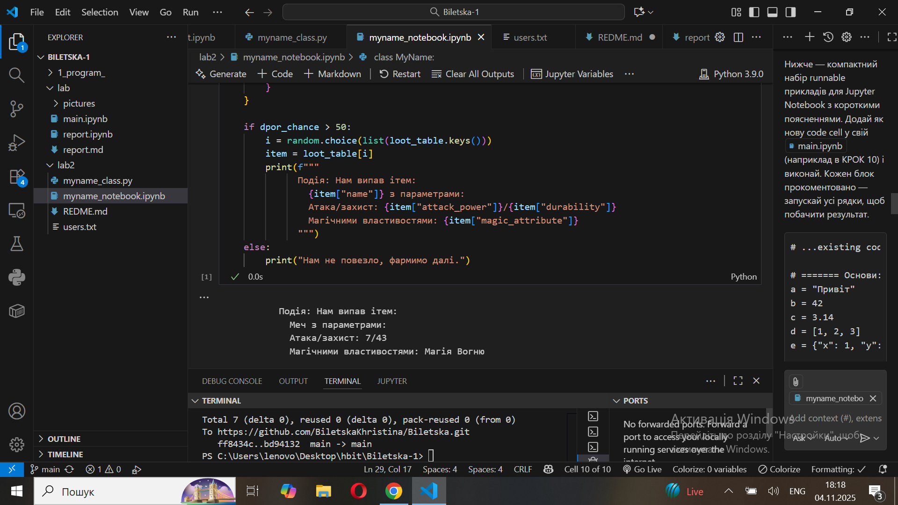

# 🧾 Звіт до лабораторної роботи №3

## 🔹 Тема: Знайомство з ООП

## 🎯 Мета роботи:

Навчитись використовувати основні принципи ООП, розглянути конструкції побудови
класу та створення об’єктів та навчитись працювати з ними.

## 🧩 Виконання роботи

### 1️⃣ Теоретичні відомості

- Клас — це шаблон або узагальнення того, що ми хочемо описати.
- Об’єкт — це конкретний екземпляр класу, який має власні значення атрибутів.

---

### 2️⃣ Класичний та ООП підхід

Класичний підхід:

```python
import random

drop_chance = random.randint(1,100)

loot_table = {
    "trash": {"name": "Поломаний меч", "rarity": "grey", "attack_power": 1, "durability": 0, "magic_attribute": "Магія Землі", "description": "Продати"},
    "Sword": {"name": "Меч", "rarity": "epic", "attack_power": random.randint(5, 10), "durability": random.randint(40, 60), "magic_attribute": "Магія Вогню", "description": "Епічний меч"},
}

if drop_chance > 50:
    item = random.choice(list(loot_table.values()))
    print(f"Нам випав ітем: {item['name']} з атакою {item['attack_power']}")
else:
    print("Нам не повезло, фармимо далі.")


```


